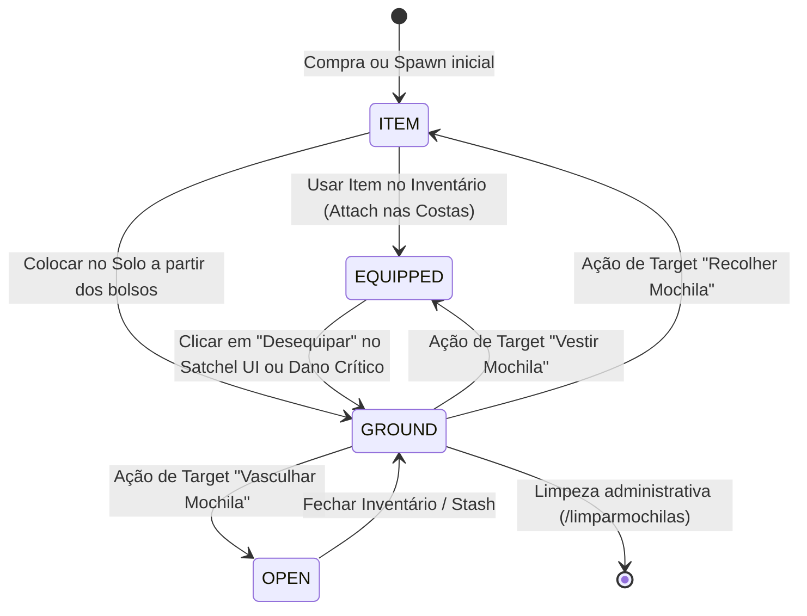
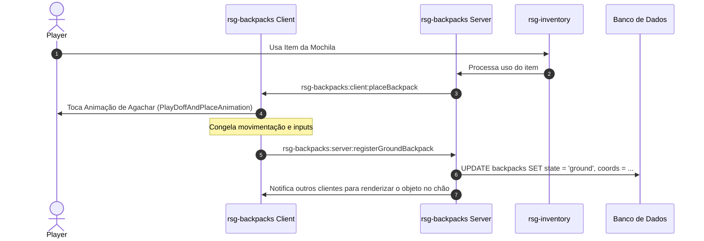
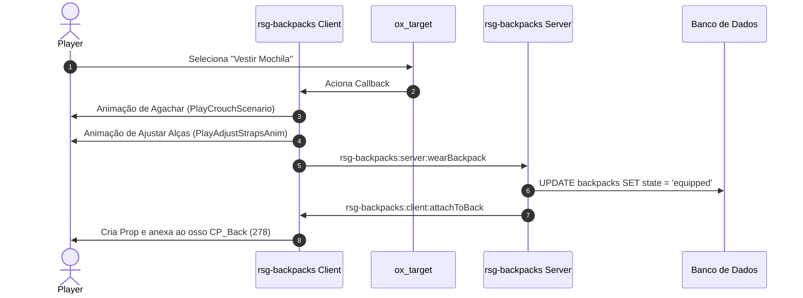
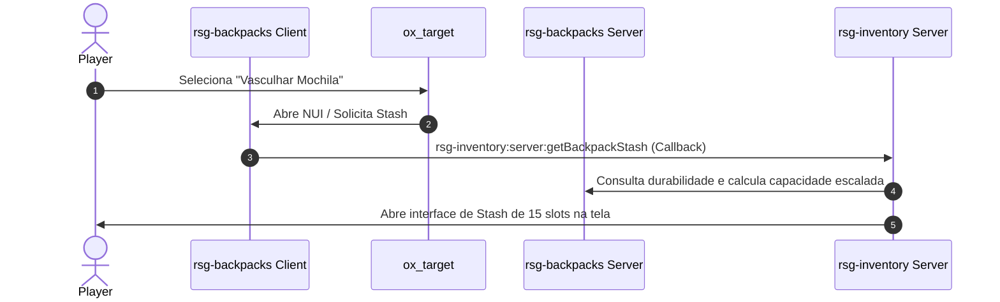

# rsg-backpacks

Sistema de mochilas físicas, imersivas e duráveis para RedM e RSG Framework.

---

## 1. Visão Geral e Objetivo
O `rsg-backpacks` gerencia mochilas físicas representadas por props tridimensionais no mundo do jogo. Ele elimina a interface tradicional de "gavetas virtuais" enquanto a mochila está equipada nas costas. As mochilas possuem durabilidade/integridade que sofre desgaste devido a eventos do mundo (tiros, quedas, fogo), limitando sua capacidade e aplicando restrições realistas de movimento de acordo com o peso carregado.

---

## 2. Diagrama de Estados da Mochila
O ciclo de vida e transições de estado de uma mochila (`ITEM`, `EQUIPPED`, `GROUND`, `OPEN`) são ilustrados no fluxo abaixo:



---

## 3. Diagramas de Sequência das Operações

### A. Equipar Mochila (Do Inventário) / Colocar no Solo (Place)


### B. Vestir Mochila (A Partir do Chão)


### C. Vasculhar Mochila (No Solo)


---

## 4. Lista de Eventos

### A. Eventos de Cliente (Client-Side)
* **`rsg-backpacks:client:placeBackpack(itemName, stashId, slot)`**
  * *Descrição:* Chamado quando o jogador usa o item de mochila em seus bolsos para colocá-lo fisicamente no solo.
* **`rsg-backpacks:client:doffAndPlaceOnGround(stashId, itemName)`**
  * *Descrição:* Chamado quando o jogador clica para desequipar a mochila ativa. Toca a animação de agachar, remove a mochila das costas e gera a entidade no chão.
* **`rsg-backpacks:client:attachToBack(stashId, modelName)`**
  * *Descrição:* Anexa o modelo correspondente de mochila no osso `CP_Back (278)` do ped do jogador.
* **`rsg-backpacks:client:syncGroundBackpacks(list)`**
  * *Descrição:* Sincroniza a lista de mochilas fisicamente existentes no chão para registro do Target (`ox_target`).
* **`rsg-backpacks:client:cleanupPlayerBackpacks()`**
  * *Descrição:* Exclui quaisquer props de mochila anexados ao ped do jogador (usado no logout ou em limpezas).

### B. Eventos de Servidor (Server-Side)
* **`rsg-backpacks:server:registerGroundBackpack(stashId, itemName, coords, heading, netId, slot)`**
  * *Descrição:* Salva no banco de dados a localização e o estado físico (`ground`) de uma mochila colocada no solo.
* **`rsg-backpacks:server:wearBackpack(stashId)`**
  * *Descrição:* Transiciona a mochila física do solo para o estado equipado (`equipped`) no jogador.
* **`rsg-backpacks:server:pickupBackpack(stashId)`**
  * *Descrição:* Recolhe a mochila do chão e a retorna como item nos bolsos do jogador.
* **`rsg-backpacks:server:damageBackpack(damageType)`**
  * *Descrição:* Envia o evento de dano corporal sofrido pelo jogador para deduzir durabilidade na mochila vestida.
* **`rsg-backpacks:server:damageGroundBackpack(stashId, damageType)`**
  * *Descrição:* Envia o evento de tiro ou queima sofrido pelo objeto físico da mochila no solo.
* **`rsg-backpacks:server:unequipBackpack()`**
  * *Descrição:* Recebe a requisição do botão "Desequipar" no cabeçalho do Satchel UI.

---

## 5. Callbacks

* **`rsg-inventory:server:getBackpackStash(uid, model)`**
  * *Parâmetros:* `uid` (string), `model` (string)
  * *Retorno:* Tabela contendo capacidade máxima recalculada (`maxweight`), slots, lista de itens salvos e a porcentagem de integridade atualizada (`durability`).

---

## 6. Exports

* **`GetBackpackWeightModifier()` (Client)**
  * *Retorno:* Retorna o multiplicador de velocidade ou o indicador de bloqueio de corrida devido ao peso da mochila atualmente vestida.
* **`GetEquippedBackpackMetadata(source)` (Server)**
  * *Retorno:* Retorna os metadados (UID, capacidade, dono) da mochila atualmente equipada por um jogador específico.

---

## 7. Schema da Tabela `backpacks`

Tabela MySQL utilizada para a persistência física das mochilas e integridade:

| Coluna | Tipo | Chave | Descrição |
| :--- | :--- | :---: | :--- |
| `uid` | `VARCHAR(50)` | PK | Identificador exclusivo único gerado por mochila. |
| `stash` | `VARCHAR(50)` | | Nome do stash usado no sistema de inventário. |
| `owner` | `VARCHAR(50)` | | CitizenID do jogador proprietário original. |
| `model` | `VARCHAR(50)` | | Hash/nome do modelo visual do prop (ex: `p_ambpack01x`). |
| `coords` | `TEXT` | | JSON contendo coordenadas `x, y, z` quando no solo. |
| `rotation` | `FLOAT` | | Heading de rotação do prop no solo. |
| `durability`| `INT` | | Valor de integridade física da mochila (0 a 100). |
| `state` | `VARCHAR(20)` | | Estado físico (`item`, `equipped`, `ground`, `open`). |
| `metadata` | `TEXT` | | JSON para parâmetros extras (ex: senhas, upgrades). |

---

## 8. Estrutura de Arquivos

```markdown
rsg-backpacks/
  ├── config.lua         # Definições de capacidade, peso, coordenadas e modelos das mochilas
  ├── fxmanifest.lua     # Declaração do recurso e ordem dos scripts do cliente/servidor
  ├── shared/
  │   └── utils.lua      # Funções de conversão e utilitários globais
  ├── client/
  │   ├── main.lua       # Fluxo de attach corporal, login e auto-detecção
  │   ├── ground.lua     # Lógica de criação de objetos físicos no solo e desequipar
  │   ├── target.lua     # Definição e registro de mira Target com os props no chão
  │   ├── weight.lua     # Monitoramento e aplicação das restrições de movimento pelo peso
  │   ├── damage.lua     # Loop de monitoramento de integridade e danos corporais/físicos
  │   └── animations.lua # Centralização das animações cinemáticas com congelamento e segurança contra morte
  └── server/
      ├── main.lua       # Eventos principais de vestir, desequipar e peso dos compartimentos
      ├── database.lua   # Funções de interface MySQL simplificadas (single, update, insert)
      ├── stash.lua      # Lógica de persistência e controle do peso dos stashes das mochilas
      ├── durability.lua # Processamento e validação de dano, itens perdidos e mochila rasgada
      ├── persistence.lua# Comandos de limpeza global e sincronizações de objetos
      └── validation.lua # Validações de segurança, distância e pesos
```

---

## 9. Regras de Negócio do Sistema

1. **Acesso Exclusivo no Chão:** A mochila não possui interface visual (gaveta) enquanto vestida nas costas. Toda interação de armazenamento requer colocá-la fisicamente no solo e usar o Target.
2. **Propriedade e Fechaduras:** Apenas o dono original (ou alguém que possua o segredo da fechadura configurada) pode acessar ou recolher a mochila do chão.
3. **Limiares de Durabilidade (Desgaste):**
   * **< 50%:** A capacidade máxima da mochila é escalada proporcionalmente à sua integridade (ex: a 40% de integridade, a capacidade cai para 40% do limite padrão). Novos itens são bloqueados caso exceda o limite.
   * **< 20%:** Há 10% de chance de derrubar 1 item aleatório no solo ao sofrer novos danos.
   * **< 10%:** A mochila é considerada destruída/rasgada. Ela se desequipa automaticamente, cai no chão como objeto inutilizado e não pode ser vestida até ser reparada.
4. **Desaceleração por Peso:** A velocidade do jogador é atenuada conforme o peso contido na mochila:
   * **Médio:** Desativa corrida rápida (sprint).
   * **Extremo:** Limita o jogador à velocidade de caminhada pesada.

---

## 10. Limitações Conhecidas e Próximos Passos
* **Roubo e Arrombamento:** O código base de restrição de propriedade já está estruturado na tabela SQL, mas a mecânica visual de arrombamento (minigame de lockpick) ou força bruta ainda depende de integração futura com scripts específicos de assalto.
* **Reparos:** A durabilidade é deduzida de forma persistente, mas a mecânica para alfaiates/jogadores restaurarem a integridade com itens (ex: pedaços de couro) precisa ser vinculada a um evento de craft ou item de reparo dedicado.
